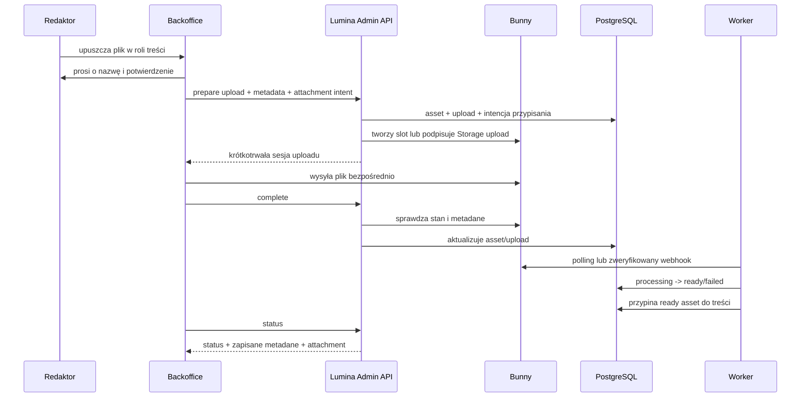

# LUMINA Backoffice — upload mediów z poziomu formularza treści

Wersja: 1.0  
Data: 2026-09-14  
Zakres: Bunny Stream, Bunny Storage + CDN, biblioteka mediów, drag & drop, automatyczne przypisywanie do treści

## 1. Cel zmiany

Redaktor ma móc utworzyć kompletną sesję, materiał lub program bez opuszczania formularza treści.

Docelowy przebieg:

1. Redaktor przeciąga obraz, wideo, audio, PDF lub inny obsługiwany plik do odpowiedniej sekcji formularza.
2. Panel rozpoznaje rodzaj pliku, odczytuje podstawowe metadane i otwiera okno **„Nazwa w bibliotece”**.
3. Redaktor podaje czytelną nazwę, potwierdza rolę, język i pozycję.
4. Backend wybiera właściwego dostawcę:
   - wideo do odtwarzania → Bunny Stream;
   - obrazy, audio, PDF, dokumenty, napisy i pliki do pobrania → Bunny Storage, dostarczane przez Bunny CDN.
5. Plik jest wysyłany bezpośrednio z przeglądarki do Bunny na podstawie krótkotrwałej autoryzacji wygenerowanej przez backend.
6. Backend zapisuje asset i pełne metadane w PostgreSQL.
7. Asset pojawia się w **Bibliotece mediów** niezależnie od tego, z którego formularza został dodany.
8. Asset zostaje przypisany do wskazanej roli treści. Jeśli treść jest jeszcze nowa, przypisanie zostaje dokończone podczas pierwszego zapisu formularza albo po zakończeniu przetwarzania.

Redaktor nadal może użyć przycisku **„Wybierz z biblioteki”**, aby przypisać wcześniej przesłany asset bez ponownego uploadu.

## 2. Rozróżnienie usług Bunny

**Bunny Stream** jest przeznaczony do filmów: przyjmuje źródło, koduje je, tworzy warianty jakości i udostępnia informacje o postępie przetwarzania.

**Bunny Storage** przechowuje zwykłe pliki. **Bunny CDN** dostarcza je użytkownikom przez Pull Zone. Do CDN nie wykonuje się osobnego uploadu.

### 2.1 Reguła wyboru dostawcy

| Plik / zastosowanie | Dostawca | Powód |
|---|---|---|
| Sesja wideo — `primary` | `bunny_stream` | kodowanie i streaming adaptacyjny |
| Materiał wideo przeznaczony do oglądania | `bunny_stream` | takie samo odtwarzanie jak sesja |
| Audio sesji — `primary` | `bunny_storage` | bezpośrednie, chronione odtwarzanie audio przez CDN |
| Audio do pobrania | `bunny_storage` | zwykły chroniony plik |
| Miniatura, hero, grafika | `bunny_storage` | statyczny asset dostarczany przez CDN |
| PDF i dokument | `bunny_storage` | plik do podglądu/pobrania |
| Napisy `.vtt` / `.srt` | `bunny_storage` albo natywny endpoint captions Stream | zależnie od sposobu odtwarzania; pierwsza wersja może użyć Storage |
| Transkrypcja | `bunny_storage` | plik pomocniczy lub tekstowy asset |

W pierwszej wersji użytkownik nie wybiera dostawcy ręcznie. Panel pokazuje wynik automatycznej decyzji, np. `Film zostanie przesłany do Bunny Stream`. Ręczna zmiana dostawcy może być dostępna wyłącznie dla roli technicznej.

### 2.2 Ważna decyzja infrastrukturalna dla Storage

Rekomendowany jest osobny Bunny Storage Zone z włączoną kompatybilnością S3. Umożliwia to generowanie przez backend podpisanych URL-i oraz upload multipart dla większych plików. Według aktualnej dokumentacji Bunny zgodność S3:

- jest nadal w public preview;
- może być włączona tylko podczas tworzenia nowej Storage Zone;
- obsługuje presigned URLs;
- obsługuje multipart upload, rekomendowany przez Bunny dla obiektów większych niż 100 MB;
- multipart może mieć do 10 000 części i wygasa po 10 dniach.

Jeśli istniejąca Storage Zone nie ma S3 compatibility, nie wolno przekazywać jej `AccessKey` do przeglądarki. W takim wariancie małe pliki mogą tymczasowo przechodzić przez endpoint backendu, ale docelowo należy utworzyć nową strefę S3-compatible.

## 3. Formularz treści — sekcja Media

Sekcja **Media** jest częścią formularza sesji, materiału i programu. Nie jest tylko linkiem do osobnej biblioteki.

Każda strefa ma dwa działania:

- **Przeciągnij plik lub wybierz z dysku**;
- **Wybierz z biblioteki**.

### 3.1 Sesja wideo

Pokazywane strefy:

1. **Główne wideo** — wymagane przed wydaniem;
2. **Miniatura** — zalecana;
3. **Hero / grafika pozioma** — opcjonalna;
4. **Napisy** — opcjonalne, wiele języków;
5. **Transkrypcja** — opcjonalna, wiele języków;
6. **Materiały do pobrania** — opcjonalne.

Strefa głównego wideo przyjmuje tylko dozwolone formaty wideo. Po upuszczeniu pliku panel automatycznie wybiera Bunny Stream.

### 3.2 Sesja audio

Pokazywane strefy:

1. **Główne audio** — wymagane przed wydaniem;
2. **Okładka / miniatura** — zalecana;
3. **Hero / grafika pozioma** — opcjonalna;
4. **Transkrypcja** — opcjonalna;
5. **Dodatkowe pliki do pobrania** — opcjonalne.

Główne audio trafia domyślnie do Bunny Storage i jest później odtwarzane przez krótko ważny URL CDN wygenerowany po autoryzacji użytkownika.

### 3.3 Materiał

Strefy zależą od `materialKind`:

- PDF/document/image/audio do pobrania → **Plik główny**;
- materiał wideo do oglądania → **Główne wideo** w Bunny Stream;
- opcjonalnie **Miniatura**;
- opcjonalnie **Warianty pliku**, np. kolor/czarno-biały albo desktop/mobile.

### 3.4 Program

Program nie może mieć medium `primary`. Pokazywane strefy:

- **Miniatura katalogowa**;
- **Hero poziome**;
- **Grafika dodatkowa**.

### 3.5 Wygląd pojedynczej strefy drag & drop

Stan pusty:

```text
┌──────────────────────────────────────────────────────────────┐
│  Główne wideo                                                │
│  Przeciągnij MP4/MOV tutaj lub [Wybierz plik]                │
│  albo [Wybierz z biblioteki]                                 │
│  Wymagane przed publikacją                                   │
└──────────────────────────────────────────────────────────────┘
```

Stan uploadu:

```text
Poranne rozluźnienie — główne wideo
poranne-rozluznienie.mp4 · 1,84 GB
[██████████████░░░░░░] 68% · Przesyłanie do Bunny Stream
[Wstrzymaj] [Anuluj]
```

Stan przetwarzania:

```text
100% wysłano · Bunny koduje film: 42%
Asset jest zapisany w bibliotece, ale nie jest jeszcze gotowy do wydania.
```

Stan gotowy:

```text
Poranne rozluźnienie — główne wideo       GOTOWE
15:04 · 1920×1080 · 1,84 GB · Bunny Stream
[Podgląd] [Zastąp] [Odłącz]
```

## 4. Okno po upuszczeniu pliku

Upload nie rozpoczyna się natychmiast. Najpierw panel pokazuje modal:

### Dodaj do biblioteki mediów

| Pole | Zachowanie |
|---|---|
| **Nazwa w bibliotece** | wymagane; wstępnie uzupełnione nazwą pliku bez rozszerzenia, np. `Poranne rozluźnienie` |
| Oryginalna nazwa pliku | tylko do odczytu |
| Rola | ustawiona ze strefy, np. `primary`; można zmienić tylko na role dozwolone dla typu treści |
| Język | puste = wspólne; wymagane dla napisów/transkrypcji zależnych od języka |
| Pozycja | domyślnie pierwsza wolna, zwykle `0` |
| Dostawca | wyliczony automatycznie i tylko do odczytu |
| Typ MIME | wykryty, tylko do odczytu |
| Rozmiar | wykryty, tylko do odczytu |
| Czas trwania | odczytany lokalnie dla audio/wideo jako informacja wstępna |
| Wymiary | odczytane lokalnie dla obrazu/wideo jako informacja wstępna |
| Tekst alternatywny | dla obrazów; opcjonalny na etapie uploadu, wymagany przez politykę dostępności przed wydaniem |

Przyciski:

- **Anuluj**;
- **Prześlij i przypisz**.

`Nazwa w bibliotece` jest nazwą redakcyjną. Nie może być używana jako klucz techniczny ani ścieżka Storage. Backend generuje bezpieczny, unikalny `assetId` oraz `objectKey`, aby dwie osoby mogły użyć podobnej nazwy bez kolizji.

## 5. Metadane odczytywane przed uploadem

Przeglądarka odczytuje tylko informacje potrzebne do walidacji i dobrego UX:

- `originalFileName`;
- `mimeType`;
- `sizeBytes`;
- rozszerzenie;
- dla obrazu: `width`, `height`;
- dla audio/wideo: wstępne `durationSeconds`, a dla wideo także `width`, `height`;
- opcjonalnie `checksumSha256`, jeśli obliczenie nie blokuje interfejsu i działa w Web Workerze.

Metadane przeglądarki nie są ostatecznym źródłem prawdy. Po uploadzie backend odczytuje metadane od Bunny i aktualizuje rekord assetu.

## 6. Wspólny przebieg backendowy



## 7. Upload do Bunny Stream

### 7.1 Przepływ

1. Frontend wysyła do Lumina API nazwę, typ pliku, rozmiar i intencję przypisania.
2. Backend tworzy rekord `content.assets` w stanie `created` oraz `media.uploads`.
3. Backend wywołuje Bunny:
   `POST https://video.bunnycdn.com/library/{libraryId}/videos` z `AccessKey` przechowywanym wyłącznie w sekrecie backendu.
4. Bunny zwraca `guid` filmu.
5. Backend generuje podpis:
   `SHA256(libraryId + apiKey + expirationUnixSeconds + videoId)`.
6. Frontend otrzymuje tylko `videoId`, `libraryId`, `AuthorizationSignature`, `AuthorizationExpire` oraz endpoint TUS.
7. Frontend używa `tus-js-client` i endpointu:
   `https://video.bunnycdn.com/tusupload`.
8. TUS zapisuje fingerprint uploadu w przeglądarce, dzięki czemu upload można wznowić.
9. Po przesłaniu bajtów frontend wywołuje `complete` w Lumina API.
10. Backend pobiera aktualny obiekt filmu z Bunny. `100% przesłania` nie oznacza jeszcze `ready`.
11. Webhook lub worker aktualizuje `queued/processing/encoding/ready/failed`.
12. Po `ready` backend zapisuje autorytatywne metadane i realizuje intencję przypisania.

### 7.2 Wymagania TUS

- użyć `tus-js-client`;
- `retryDelays`: np. `0, 3 s, 5 s, 10 s, 20 s, 60 s`;
- przed rozpoczęciem szukać poprzedniego uploadu przez `findPreviousUploads()`;
- pozwolić na pause/resume/cancel;
- nowy podpis może wznowić ten sam `videoId`; nie trzeba tworzyć drugiego filmu;
- czas ważności podpisu musi być realistyczny dla dużych plików; dokumentacja zaleca minimum godzinę;
- nie traktować 404 po wygaśnięciu TUS jako informacji, że asset nigdy nie istniał;
- porzucone sloty filmów sprząta worker z idempotentnym delete.

### 7.3 Mapowanie statusów Bunny Stream

| Bunny | Stan Lumina | Znaczenie UI |
|---|---|---|
| 6 PresignedUploadStarted | `uploading` | wysyłanie |
| 7 PresignedUploadFinished | `processing` | bajty wysłane, czekamy na kodowanie |
| 0 Queued | `processing` | kolejka kodowania |
| 1 Processing | `processing` | analiza pliku |
| 2 Encoding | `processing` | kodowanie |
| 4 Resolution finished | `processing` lub `playable` | co najmniej jedna rozdzielczość gotowa, ale wydanie powinno używać ustalonej polityki |
| 3 Finished | `ready` | pełne kodowanie zakończone |
| 5 lub 8 Failed | `failed` | błąd wymagający retry/nowego pliku |

Rekomendacja Lumina: do wydania dopuszczać dopiero Bunny `Finished = 3`. Status `4` może umożliwiać podgląd redakcyjny, ale nie aktywację release.

### 7.4 Autoryzacja webhooka

Backend odbiera surowe body i sprawdza:

- `X-BunnyStream-Signature-Version = v1`;
- `X-BunnyStream-Signature-Algorithm = hmac-sha256`;
- `X-BunnyStream-Signature` przez stałoczasowe porównanie HMAC-SHA256 surowego body;
- sekret podpisu: `Read-Only API key` biblioteki Bunny, zgodnie z aktualną dokumentacją;
- idempotencję po provider event/status/correlation.

Nie parsować JSON i nie serializować go ponownie przed weryfikacją podpisu.

## 8. Upload do Bunny Storage i dostarczanie przez CDN

### 8.1 Rekomendowany wariant — S3 presigned upload

1. Backend tworzy `assetId`, bezpieczny `objectKey` i rekord uploadu.
2. Backend wybiera:
   - pojedynczy podpisany `PUT` dla mniejszego pliku;
   - presigned multipart upload dla pliku większego niż 100 MB.
3. Frontend przesyła plik bezpośrednio do Bunny Storage.
4. Frontend wysyła do API ETag-i części oraz informację o zakończeniu.
5. Backend finalizuje multipart, wykonuje `HEAD Object` i zapisuje autorytatywne metadane.
6. Dostęp użytkownika odbywa się przez Pull Zone/Bunny CDN i krótko ważny URL wygenerowany przez backend po sprawdzeniu uprawnień.

Storage Zone Password/Secret Access Key nigdy nie trafia do bundla frontendu ani do odpowiedzi API.

### 8.2 Ścieżka obiektu

Proponowany klucz:

```text
{environment}/{assetKind}/{yyyy}/{MM}/{assetId}/{sanitizedOriginalFileName}
```

Przykład:

```text
staging/images/2026/09/01994f.../poranna-joga-cover.webp
```

Nie używać samej nazwy redakcyjnej ani canonical key jako unikalnej ścieżki.

### 8.3 Wariant zgodnościowy bez S3

Jeżeli Storage Zone nie obsługuje S3:

- backend może przyjąć mały plik i przesłać go do Bunny Storage przez HTTP `PUT` z `AccessKey`;
- plik jest wysyłany jako raw binary, bez Base64 i bez JSON;
- można przekazać nagłówek `Checksum` z SHA256 w uppercase hex;
- to rozwiązanie zwiększa transfer i czas pracy Cloud Run, więc powinno być limitem przejściowym, np. do 25–50 MB;
- większe pliki powinny czekać na nową S3-compatible Storage Zone.

Nie wolno rozwiązać problemu przez wpisanie Storage `AccessKey` do `VITE_*` lub JavaScriptu.

## 9. Zapis metadanych

### 9.1 `content.assets`

Każdy plik jest widoczny w bibliotece od chwili przygotowania uploadu.

| Pole | Źródło |
|---|---|
| `id` | Lumina UUID/UUIDv7 |
| `display_name` | nazwa podana przez redaktora |
| `original_file_name` | przeglądarka |
| `kind` | rozpoznane i zweryfikowane przez backend |
| `provider` | `bunny_stream` lub `bunny_storage` |
| `external_id` | Stream GUID albo Storage object key |
| `provider_library_id` | Stream library ID, jeśli dotyczy |
| `storage_zone` | logiczny identyfikator strefy, bez sekretu |
| `mime_type` | klient wstępnie, provider/backend ostatecznie |
| `bytes` | provider/backend |
| `checksum_sha256` | klient/provider/backend, gdy dostępne |
| `width`, `height` | provider/backend |
| `duration_seconds` | provider/backend |
| `provider_status` | created/uploading/processing/ready/failed/deleted |
| `provider_metadata` | zredagowany JSONB do diagnostyki |
| `ready_at`, `failed_at`, `failure_code` | backend/worker |
| `created_by_user_id`, `created_at`, `updated_at` | backend |

### 9.2 Dodatkowe metadane Bunny Stream

Po `GET Video` backend może zapisać w zredagowanym `provider_metadata`:

- `guid`, `videoLibraryId`;
- `dateUploaded`;
- `length`;
- `status`, `encodeProgress`;
- `framerate`, `width`, `height`, `rotation`;
- `outputCodecs`, `availableResolutions`;
- `storageSize`;
- `thumbnailFileName`, bezpieczny thumbnail locator/URL;
- `hasOriginal`, `originalHash`;
- `transcodingMessages` po odfiltrowaniu danych niepotrzebnych i wrażliwych.

Pola najczęściej filtrowane w panelu powinny mieć osobne kolumny. `provider_metadata` jest dodatkiem diagnostycznym, nie głównym modelem domenowym.

### 9.3 `media.uploads`

Dodatkowo do obecnego kontraktu zapisać:

- `draft_context_id`;
- `target_resource_id`, nullable;
- `intended_role`;
- `intended_locale`, nullable;
- `intended_position`;
- `display_name`;
- `upload_protocol`: `tus`, `s3_put`, `s3_multipart`, `api_proxy`;
- `provider_upload_id`, jeśli dotyczy;
- `parts_count` i stan multipart bez sekretów/podpisanych URL-i;
- `attachment_status`: pending/attached/replaced/failed;
- standardowe statusy, bajty, expiry, błędy i timestamps.

Podpisanych URL-i, nagłówków TUS, `AccessKey`, API key ani webhook secret nie zapisuje się w bazie i audycie.

## 10. Dodawanie z nowego, jeszcze niezapisanego formularza

To jest kluczowe dla wymagania „wszystko z poziomu formularza”.

1. Przy otwarciu formularza frontend generuje `draftContextId` (UUID).
2. Każdy upload zawiera `draftContextId` i intencję przypisania: rola, locale, pozycja, typ treści.
3. Asset od razu jest zapisywany w bibliotece mediów, nawet jeśli zasób treści nie ma jeszcze `resourceId`.
4. Przy pierwszym zapisie sesji/materiału/programu request zawiera `draftContextId`.
5. Backend w jednej transakcji:
   - tworzy resource i pierwszą rewizję;
   - wiąże uploady/assety z nowym `resourceId`;
   - dla assetów `ready` tworzy `content.resource_assets`;
   - dla `uploading/processing` pozostawia attachment intent, który worker wykona po `ready`.
6. Odpowiedź formularza zwraca resource oraz pełną listę: `attachedAssets` i `pendingAssets`.

Jeśli redaktor zamknie formularz bez zapisu, asset pozostaje w bibliotece jako `unassigned`. Panel pokazuje go w filtrze **Nieprzypisane**, a zadanie porządkowe może oznaczyć go do usunięcia po konfigurowalnym czasie. Nie usuwać automatycznie gotowego pliku natychmiast po porzuceniu formularza.

## 11. Dodawanie z istniejącej treści

1. Upload request zawiera `resourceId` oraz intencję przypisania.
2. Asset zapisuje się w bibliotece natychmiast.
3. Jeśli po zakończeniu jest `ready`, backend przypina go do zasobu.
4. Jeśli wymaga przetwarzania, intencja jest wykonywana przez worker dopiero po `ready`.
5. UI pokazuje element w sekcji treści jako `Przetwarzanie — zostanie przypisany automatycznie`.
6. Po polling/webhook frontend odświeża assety zasobu i bibliotekę.

Unikalność pozostaje `(resourceId, role, locale, position)`. Jeżeli miejsce jest zajęte, przed uploadem panel pyta:

> W tej roli jest już przypisany asset „Stara miniatura”. Czy po zakończeniu uploadu zastąpić go nowym? Stary asset pozostanie w bibliotece.

Zastąpienie tworzy wpis audytowy i nie usuwa starego pliku od dostawcy.

## 12. Proponowany kontrakt API

Nazwy należy dopasować do rzeczywistego OpenAPI, ale zachować semantykę.

### 12.1 Przygotowanie uploadu

```http
POST /api/v1/admin/media/uploads
Idempotency-Key: <uuid>
Authorization: Bearer <firebase-id-token>
```

```json
{
  "draftContextId": "uuid",
  "targetResourceId": null,
  "targetResourceType": "session",
  "displayName": "Poranne rozluźnienie",
  "originalFileName": "IMG_1842-final.mp4",
  "mimeType": "video/mp4",
  "sizeBytes": 1975684956,
  "clientMetadata": {
    "durationSeconds": 904.2,
    "width": 1920,
    "height": 1080,
    "checksumSha256": null
  },
  "attachment": {
    "role": "primary",
    "locale": null,
    "position": 0,
    "replaceExisting": false
  }
}
```

Backend sam wylicza provider. Nie ufa wartości `provider` wysłanej przez zwykłego redaktora.

### 12.2 Odpowiedź dla Bunny Stream

```json
{
  "uploadId": "uuid",
  "assetId": "uuid",
  "provider": "bunny_stream",
  "status": "created",
  "protocol": "tus",
  "endpoint": "https://video.bunnycdn.com/tusupload",
  "authorization": {
    "libraryId": "123456",
    "videoId": "provider-guid",
    "signature": "short-lived-signature",
    "expiresAt": "2026-09-14T22:00:00Z"
  },
  "metadata": {
    "filetype": "video/mp4",
    "title": "Poranne rozluźnienie"
  }
}
```

### 12.3 Odpowiedź dla Bunny Storage

Mały plik:

```json
{
  "uploadId": "uuid",
  "assetId": "uuid",
  "provider": "bunny_storage",
  "status": "created",
  "protocol": "s3_put",
  "uploadUrl": "short-lived-presigned-url",
  "requiredHeaders": {
    "Content-Type": "image/webp"
  },
  "objectKey": "staging/images/2026/09/uuid/poranna-joga.webp",
  "expiresAt": "2026-09-14T21:00:00Z"
}
```

Duży plik może zwrócić `protocol: s3_multipart`, `providerUploadId`, `partSizeBytes` oraz endpoint do pobierania podpisu dla kolejnej części. Nie zwracać wszystkich tysięcy URL-i z góry.

### 12.4 Zakończenie

```http
POST /api/v1/admin/media/uploads/{uploadId}/complete
Idempotency-Key: <ten-sam-dla-intencji-complete>
```

```json
{
  "uploadedBytes": 1975684956,
  "checksumSha256": "optional",
  "parts": null
}
```

Odpowiedź:

```json
{
  "uploadId": "uuid",
  "asset": {
    "assetId": "uuid",
    "displayName": "Poranne rozluźnienie",
    "originalFileName": "IMG_1842-final.mp4",
    "kind": "video",
    "provider": "bunny_stream",
    "providerStatus": "processing",
    "externalId": "provider-guid",
    "mimeType": "video/mp4",
    "bytes": 1975684956,
    "durationSeconds": null,
    "width": null,
    "height": null,
    "createdAt": "2026-09-14T20:00:00Z"
  },
  "attachment": {
    "status": "pending",
    "role": "primary",
    "locale": null,
    "position": 0
  }
}
```

Po przetworzeniu status response zwraca uzupełnione, autorytatywne metadane.

### 12.5 Zapis nowej treści

```json
{
  "draftContextId": "ten-sam-uuid",
  "canonicalKey": "poranne-rozluznienie",
  "locale": "pl",
  "title": "Poranne rozluźnienie",
  "mediaKind": "video",
  "accessTier": "premium",
  "snapshot": {}
}
```

Odpowiedź rozszerzona:

```json
{
  "resourceId": "uuid",
  "revisionId": "uuid",
  "revisionNumber": 1,
  "assets": {
    "attached": [],
    "pending": [
      {
        "assetId": "uuid",
        "uploadId": "uuid",
        "role": "primary",
        "providerStatus": "processing"
      }
    ]
  }
}
```

## 13. Walidacja plików

Walidacja odbywa się dwukrotnie: szybko w frontendzie i autorytatywnie w backendzie.

### 13.1 Przykładowe formaty

- Stream video: `.mp4`, `.m4v`, `.mkv`, `.webm`, `.mov`, `.avi` oraz inne oficjalnie wspierane przez Bunny;
- audio: `.mp3`, `.ogg`, `.wav`; dodatkowe formaty dopiero po potwierdzeniu ich obsługi u wybranego dostawcy;
- captions: `.vtt`, `.srt`;
- obrazy: ograniczona allowlista, np. JPEG, PNG, WebP;
- dokumenty: PDF i jawnie dozwolone typy.

Nie polegać wyłącznie na rozszerzeniu i `File.type`. Backend sprawdza allowlistę, magic bytes/signature tam, gdzie jest to zasadne, oraz zgodność typu z rolą.

### 13.2 Reguły domenowe

- session video `primary` przyjmuje video;
- session audio `primary` przyjmuje audio;
- program nie przyjmuje `primary`;
- thumbnail/hero/artwork przyjmuje image;
- captions przyjmuje VTT/SRT oraz wymaga locale;
- `download` musi wskazywać na materiał dopuszczony do pobrania;
- `ready` jest wymagane do build release;
- processing/failed/expired nie może wejść do wydania;
- limity wielkości pochodzą z konfiguracji API i są zwracane frontendowi, nie są zaszyte wyłącznie w UI.

## 14. Zachowanie biblioteki mediów

Każdy rozpoczęty upload ma rekord w bibliotece lub zakładce Uploady.

Filtry:

- nazwa redakcyjna;
- original filename;
- provider;
- rodzaj;
- status;
- przypisane / nieprzypisane;
- resource ID/canonical key;
- created by;
- data utworzenia;
- provider ID/object key.

Akcje:

- podgląd;
- przypisz do treści;
- pokaż miejsca użycia;
- odśwież metadane providera;
- ponów upload;
- odłącz;
- bezpiecznie usuń.

Usunięcie assetu używanego przez aktywne wydanie zwraca konflikt. Odłączenie od draftu nie usuwa pliku. Provider delete jest osobną, audytowaną operacją przez outbox/worker.

## 15. Błędy i odzyskiwanie

| Sytuacja | Zachowanie |
|---|---|
| brak nazwy | upload nie startuje; focus na `Nazwa w bibliotece` |
| niedozwolony typ | strefa pokazuje dozwolone formaty |
| sieć zerwana przy Stream | wznowienie TUS tego samego uploadu/videoId |
| podpis TUS wygasł | backend generuje nowy podpis dla tego samego videoId, jeśli upload nadal istnieje |
| multipart przerwany | wznowienie brakujących części |
| complete wysłane dwa razy | idempotentna odpowiedź tego samego uploadu |
| Bunny nadal przetwarza | status `processing`; polling i webhook |
| kodowanie nieudane | `failed`, bez automatycznego release; pokaż bezpieczny failure code |
| treść zapisana przed końcem uploadu | attachment `pending`, worker przypina po ready |
| formularz porzucony | asset `unassigned`, dostępny w bibliotece |
| konflikt rola/locale/position | jawne potwierdzenie replace, bez cichego nadpisania |
| nieznany wynik requestu | odśwież status po `uploadId`/idempotency key przed ponowieniem |

## 16. Bezpieczeństwo

- Stream API key, Storage Zone Password, S3 Secret Access Key, playback token key i webhook secret pozostają w Secret Managerze/konfiguracji backendu;
- frontend otrzymuje tylko krótkotrwałe, zawężone podpisy;
- podpis ogranicza provider, obiekt/videoId, czas, metodę i — gdzie protokół pozwala — rozmiar/content type;
- żadnego sekretu w `VITE_*`, localStorage, logach, telemetryce ani audit payload;
- signed playback/download URL powstaje dopiero po server-side access evaluation;
- API sprawdza `media.upload` i `media.assign` osobno;
- nazwa pliku jest normalizowana i nie buduje ścieżki bezpośrednio;
- webhook Stream jest podpisany i deduplikowany;
- retry create provider object jest chroniony idempotency key;
- audit zapisuje actor, asset, resource, role i wynik, ale nie credentiale.

## 17. Podział implementacji w architekturze .NET

### Contracts

- `PrepareMediaUploadRequest/Response`;
- union `TusUploadSession`, `S3PutUploadSession`, `S3MultipartUploadSession`;
- `CompleteMediaUploadRequest/Response`;
- `MediaAssetDto`, `MediaAttachmentDto`;
- `CommitDraftMediaRequest` lub `draftContextId` w create content DTO.

### Domain

- `MediaUpload` state machine;
- `MediaAttachmentIntent`;
- reguła wyboru provider strategy;
- walidacja roli, rodzaju pliku, locale i pozycji;
- przejścia created/uploading/processing/ready/failed/cancelled/expired;
- zakaz użycia non-ready asset w release.

### CommandServices

- prepare upload;
- complete upload;
- cancel/retry;
- commit pending attachments po utworzeniu treści;
- replace/detach;
- request provider deletion.

### QueryServices

- upload status;
- media library list;
- asset details/provider metadata;
- resource assets wraz z pending intents;
- asset usages.

### Integrations

- `IBunnyStreamVideoGateway`;
- `IBunnyStorageGateway` lub S3-compatible client;
- generowanie podpisu TUS;
- generowanie presigned PUT/multipart URLs;
- `GetVideo`, `HeadObject`, complete multipart, delete;
- zredagowane logowanie.

### Worker

- polling Stream processing;
- obsługa zweryfikowanych webhooków;
- finalizacja attachment intent po `ready`;
- cleanup porzuconych uploadów i multipart sessions;
- idempotentne provider deletion;
- retry/dead-letter/alerting.

### Persistence

- rozszerzenie `content.assets`;
- rozszerzenie `media.uploads`;
- nowa `media.attachment_intents` lub równoważny model;
- indeksy status/last_polled_at, draft_context_id, target_resource_id, created_by/created_at;
- unikalność provider locator i resource role/locale/position.

## 18. Frontend — komponenty

```text
features/media/
  components/
    MediaDropZone.tsx
    MediaUploadDialog.tsx
    MediaUploadQueue.tsx
    MediaAssetCard.tsx
    MediaAssetPicker.tsx
    MediaAttachmentSlot.tsx
    MediaMetadataSummary.tsx
    MediaReplaceDialog.tsx
  hooks/
    usePrepareUpload.ts
    useTusUpload.ts
    useS3PutUpload.ts
    useS3MultipartUpload.ts
    useUploadStatus.ts
    useDraftMediaContext.ts
  model/
    mediaUpload.ts
    mediaAttachment.ts
    providerRouting.ts
  api/
    mediaApi.ts
```

`MediaAttachmentSlot` przyjmuje:

```ts
type MediaAttachmentSlotProps = {
  draftContextId: string;
  resourceId?: string;
  resourceType: 'session' | 'material' | 'program';
  mediaKind?: 'video' | 'audio';
  role: 'primary' | 'thumbnail' | 'hero' | 'artwork' | 'download' | 'caption' | 'transcript';
  locale?: string;
  position: number;
  requiredForRelease?: boolean;
  value?: MediaAttachmentViewModel;
};
```

Stan uploadu jest zachowany poza pojedynczą zakładką formularza. Przejście między sekcjami nie może anulować transferu.

## 19. Kryteria akceptacyjne

### Happy path

- redaktor tworzy nową sesję wideo;
- przeciąga MP4 do `Główne wideo`;
- panel odczytuje filename, MIME, size, duration i dimensions;
- panel prosi o nazwę;
- backend wybiera Bunny Stream;
- upload TUS dochodzi do 100%, a potem pokazuje processing;
- asset jest widoczny w bibliotece;
- redaktor zapisuje sesję przed końcem kodowania;
- po Bunny `Finished` worker zapisuje metadata i przypina asset jako primary;
- release validation akceptuje sesję dopiero po `ready`.

### Storage

- obraz przeciągnięty do `Miniatura` trafia do Bunny Storage;
- frontend nie otrzymuje Storage secret;
- upload bezpośredni kończy się autorytatywnym HEAD/metadata sync;
- asset jest widoczny w bibliotece i przypisany do treści;
- pobranie/podgląd korzysta z CDN, nie z management Storage endpoint.

### Odporność

- zerwanie sieci wznawia TUS/multipart bez drugiego assetu;
- ponowione prepare/complete z tym samym idempotency key nie duplikuje providera ani rekordu;
- przetwarzany plik nie wchodzi do wydania;
- porzucony formularz zostawia asset jako unassigned;
- replace nie usuwa starego assetu;
- brak uprawnienia `media.upload` blokuje przygotowanie uploadu po stronie API;
- żaden klucz Bunny nie występuje w bundlu, odpowiedziach ani logach frontendu.

## 20. Gotowe zadanie dla GitHub Copilot Agent

```text
Rozbuduj LUMINA Backoffice i Lumina_api o upload wszystkich mediów bezpośrednio z formularza treści.

Najpierw przeczytaj AGENTS.md, aktualne OpenAPI, backoffice-contracts-and-data-model.md oraz lumina-backoffice-media-upload-spec.md. Backendem jest .NET 10 CQRS + PostgreSQL, Firebase służy do uwierzytelniania. Nie implementuj Firestore.

Wymagany UX:
- każda sesja, materiał i program ma sekcję Media;
- role mają osobne MediaAttachmentSlot z drag & drop i „Wybierz z biblioteki”;
- po dropie odczytaj filename/MIME/size oraz możliwe duration/dimensions;
- przed uploadem zawsze pokaż modal z wymaganym polem „Nazwa w bibliotece”, prefillem z nazwy pliku, rolą, locale, position i wykrytym providerem;
- wideo do oglądania kieruj do Bunny Stream;
- audio, obrazy, PDF, dokumenty, napisy i downloady kieruj do Bunny Storage + CDN;
- asset ma zostać zapisany w media library i przypisany do treści bez opuszczania formularza;
- dla nowej, niezapisanej treści użyj draftContextId i trwałej attachment intent;
- zapis treści wiąże pending uploady z resourceId; worker przypina je po ready;
- stary asset po replace pozostaje w bibliotece.

Bunny Stream:
- backend tworzy video object;
- backend generuje TUS SHA256 signature;
- frontend używa tus-js-client i obsługuje resume/pause/cancel/progress;
- API key nigdy nie trafia do frontendu;
- complete nie oznacza ready; backend sprawdza Get Video;
- webhook HMAC i polling aktualizują status;
- release dopuszcza dopiero Finished/ready.

Bunny Storage:
- użyj S3-compatible Storage Zone i presigned PUT lub multipart;
- multipart dla >100 MB;
- frontend nigdy nie otrzymuje Storage Zone Password/Secret Access Key;
- po uploadzie backend robi HEAD/final verification i zapisuje metadata;
- dostarczanie pliku odbywa się przez Pull Zone/CDN i short-lived URL po sprawdzeniu dostępu;
- jeśli obecna strefa nie ma S3, zapisz to jako blokadę/migrację. Nie wkładaj AccessKey do VITE_*.

Zapisz w content.assets: displayName, originalFileName, kind, provider, externalId/objectKey, providerLibraryId/storageZone, mimeType, bytes, checksumSha256, width, height, durationSeconds, providerStatus, sanitized providerMetadata, readyAt/failure i audit fields.

Rozszerz media.uploads o draftContextId, targetResourceId, intended role/locale/position, displayName, protocol, provider upload id, attachmentStatus i standardowy stan uploadu. Dodaj attachment intent, jeśli obecny model nie zapewnia trwałego powiązania uploadu z nową treścią.

Dodaj endpointy/komendy prepare, status, complete, cancel/resume credentials, multipart parts, attach/replace/detach, asset usages i commit draft media. Nazwy dopasuj do istniejących konwencji i OpenAPI; nie duplikuj istniejących endpointów.

Zachowaj idempotencję create/complete/delete, optimistic concurrency przy replace oraz audit. Nie proxy'uj dużego pliku przez Cloud Run.

Frontend: React/Vite/TypeScript/MUI/TanStack Query/RHF/Zod. Upload queue musi przeżyć zmianę zakładki formularza. Zastosuj lazy polling tylko do stanów terminalnych.

Dodaj testy:
- provider routing;
- MIME/role validation;
- TUS signature i webhook verification;
- idempotent retry;
- metadata mapping;
- pending attachment po zapisaniu nowej treści;
- release rejection dla non-ready;
- frontend modal z nazwą, progress, resume, replace i media library refresh;
- test, że build frontendu nie zawiera sekretów Bunny.

Najpierw wykonaj analizę luk i przedstaw minimalny vertical slice. Następnie wdrażaj kolejno:
1. model i kontrakty;
2. Stream TUS end-to-end;
3. Storage presigned upload;
4. draftContextId + attachment intents;
5. drag & drop we wszystkich formularzach;
6. worker/webhook/cleanup;
7. testy integracyjne i E2E.

Po każdym etapie uruchom dotnet test, frontend lint/typecheck/test/build. Nie wdrażaj na PROD.
```

## 21. Źródła techniczne Bunny

- [Bunny Stream — TUS resumable uploads](https://bunny.net/docs/stream/tus-resumable-uploads)
- [Bunny Stream — HTTP upload](https://bunny.net/docs/stream/http-api)
- [Bunny Stream — webhooki](https://bunny.net/docs/stream/webhooks)
- [Bunny Stream — Get Video metadata](https://bunny.net/docs/api-reference/stream/manage-videos/get-video)
- [Bunny Stream — obsługiwane formaty](https://bunny.net/docs/stream/video-specification)
- [Bunny Storage — HTTP](https://bunny.net/docs/storage/http)
- [Bunny Storage — S3 compatibility](https://bunny.net/docs/storage/s3)
- [Bunny Storage — Upload File API](https://bunny.net/docs/api-reference/storage/manage-files/upload-file)
